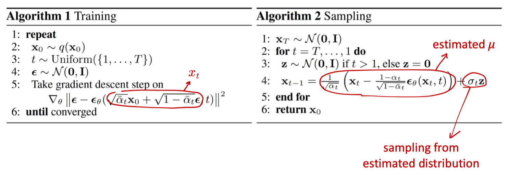

# Diffusion Models 

[slide link](https://mit-6s978.github.io/assets/pdfs/lec4_diffusion.pdf)

## ToC

<!--toc:start-->
- [Diffusion Models](#diffusion-models)
  - [ToC](#toc)
  - [Diffusion Models Overview](#diffusion-models-overview)
    - [Forward Process](#forward-process)
    - [Reverse Process](#reverse-process)
    - [Training Objective](#training-objective)
    - [Noise Conditional Network](#noise-conditional-network)
  - [Energy-based Models and Score Matching](#energy-based-models-and-score-matching)
    - [Energy-based Models](#energy-based-models)
    - [Score Matching](#score-matching)
<!--toc:end-->

## Diffusion Models Overview

- **Forward process**: add noise to input data
- **Reverse process**: learn to generate data by denoising
- **Training objective**: from hierarchical VAE to L2 loss
- **Noise Conditional Network**: represent distributions

### Forward Process

$$
q\left(\mathbf{x}_t \mid \mathbf{x}_{t-1}\right)=\mathcal{N}\left(\mathbf{x}_t \mid \sqrt{1-\beta_t} \mathbf{x}_{t-1}, \beta_t \mathbf{I}\right) \quad q\left(\mathbf{x}_{1: T} \mid \mathbf{x}_0\right)=\prod_{t=1}^T q\left(\mathbf{x}_t \mid \mathbf{x}_{t-1}\right)
$$

The data sample $\mathbf{x}_0$ gradually loses its distinguishable features as the step $t$ becomes larger.

- 系数的设计是为了让方差保持不变
    - $x_t = ax_{t-1} + b\epsilon_{t-1}$，只有当 $a^2 + b^2 = 1$ 的时候最后的方差系数为1，即 $q\left(\mathbf{x}_T \mid \mathbf{x}_0\right) \approx \mathcal{N}\left(\mathbf{x}_T ; \mathbf{0}, \mathbf{I}\right)$
- 第一项是$x_t$的均值，第二项的系数是$x_t$的方差
- $\beta$ 在这里起到一个**schedule**的作用，是超参数

通过重参数化（reparameterization trick）我们可以求出 $q(x_t \mid x_0)$  
$\text { Let } \alpha_t=1-\beta_t \text { and } \bar{\alpha}_t=\prod_{i=1}^t \alpha_i$,

$$
\begin{array}{rlr}
\mathbf{x}_t & =\sqrt{\alpha_t} \mathbf{x}_{t-1}+\sqrt{1-\alpha_t} \epsilon_{t-1} & ; \text { where } \boldsymbol{\epsilon}_{t-1}, \boldsymbol{\epsilon}_{t-2}, \cdots \sim \mathcal{N}(\mathbf{0}, \mathbf{I}) \\
& =\sqrt{\alpha_t \alpha_{t-1}} \mathbf{x}_{t-2}+\sqrt{1-\alpha_t \alpha_{t-1}} \bar{\epsilon}_{t-2} & \text {;where } \overline{\boldsymbol{\epsilon}}_{t-2} \text { merges two Gaussians (*). } \\
& =\cdots & \\
& =\sqrt{\bar{\alpha}_t} \mathbf{x}_0+\sqrt{1-\bar{\alpha}_t} \boldsymbol{\epsilon} \\
q\left(\mathbf{x}_t \mid \mathbf{x}_0\right) & =\mathcal{N}\left(\mathbf{x}_t ; \sqrt{\bar{\alpha}_t} \mathbf{x}_0,\left(1-\bar{\alpha}_t\right) \mathbf{I}\right) &
\end{array}
$$

根据上述式子，我们就可以采样任意时间的$x_t$

- 所以正向的过程，其实是从上一个状态的**conditional distributions**中采样一个新的$x_t$的过程
    - sampling without simulation
    - $x_t$ from $x_0$ in closed form

### Reverse Process

我们要求解的是逆向的过程，即 $q(x_{t-1} \mid x_{t}$)

直接求解是不可能的，因为我们无法遍历整个数据集。所以需要用一个model去近似这些条件概率，比如Gaussian 

同时我们还有一个真实的数据样本$x_0$，condition on$x_0$之后的分布也是可求的

最后用KL散度作为目标函数来优化

- 在实际训练的时候，方差是preset的，只有均值$\mu_{\theta}$是learn的
- 用 $\mu_{\theta}$ 来估计前向过程的noise，用L2 loss监督

### Training Objective

- $L_{VLB}$: variational lower bound（变分下界，类似ELBO）
- $L_{T}$: 常数，没有参数
- $L_{t-1}$: L2 loss on noise
- $L_{0}$: recon loss, like VAE

- 通常把 $w_t$ 设置为1
- $\epsilon_{\theta}$ is network to predict noise
- $t$ is time steps, conditioned on noise level

### Noise Conditional Network

- Diffusion models decompose a distribuVon into many simpler ones.
- We can combine all into one “powerful” network.
- This network is condiVoned on noise level $t$.

- input:
    - $x_t$: noise image (also condition)
    - $t$: noise level (also condition)
- output:
    - $\mu$ and $\sigma$ of a distribution，实际上只需要求$\mu$

Diffusion algorithm annotations

- 从标准高斯分布中采样$x_{T}$，不断地通过逆向过程，得到$x_{t-1}$，直到得到$x_0$
- 求梯度优化

## Energy-based Models and Score Matching

### Energy-based Models

- Define a **scalar** function $E(x)$, called "energy".
- At **inference** time, find $x$ that minimizes energy.
- 可以用于建模概率分布：
    - $p(x) = \frac{exp(-E(x))}{Z}$, $Z$是归一化常数
- "Score function": Gradient of log-probability.
    - 上面的概率分布对变量求导，得到一个非归一化概率模型：$\nabla_x \log p(x)=-\nabla_x E(x)$

### Score Matching

> Kimi的解释
> 
