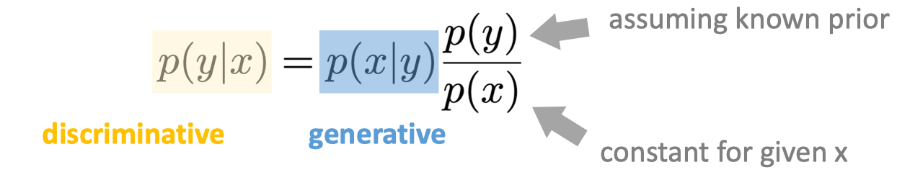
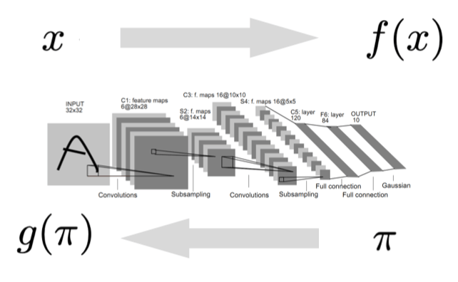

# Introduction

[slide link](https://mit-6s978.github.io/assets/pdfs/lec1_intro.pdf)

## ToC

<!--toc:start-->
- [Introduction](#introduction)
  - [ToC](#toc)
  - [Generative Models](#generative-models)
  - [Probabilistic modeling](#probabilistic-modeling)
  - [Deep Generative Models](#deep-generative-models)
<!--toc:end-->

## Generative Models

The features of generative models is:

- There are **multiple or infinite** predictions to one input.
- Some predictions are more **“plausible”** than some others.
- Training data may contain **no exact solution**.
- Predictions may be **more complex**, more informative, and higher-dimensional than input.

> Discriminative vs. Generative models (判别模型和生成模型)
> discriminative: from sample(image) to label(class), one desired output.
> generative: from label(class) to sample(image), many possible outputs.

Generative models can be discriminative: Bayes'rule. 
Here $x$ is the sample, we take it as a dog image, $y$ is the label, we take it as a text "dog".

But discriminative models can't be generative, since still need to model prior distribution of sample.

很简单的理解，如果一个模型没有见过狗长什么样(prior distrubution)，当然无法生成很像狗的图片。

The challenge is about **representing and predicting distributions**.

## Probabilistic modeling

Probability is part of the modeling. 

Given the data, the generative model estimates the distribution of data. Then when sample new data $x^{\prime} \sim p(x \mid y)$, model estimates the prob density.

## Deep Generative Models

Learning to represent **data instances**(from data to feature)
- map data to single feature
- minimize loss w/ target

Learning to represent **probability distributions**(from distribution to distribution)
- map a simple distribution (Gaussian/uniform) to a complex one
- minimize loss w/ data distribution

Not all parts of distribution modeling is done by learning. 

- Autoregressive model
    - The dependency graph is designed (not learned).
    - The mapping function is learned (e.g., Transformer)
- Diffusion model
    - The dependency graph is designed (not learned).
    - The mapping function(denoising) is learned (e.g., Unet)

将真实世界中的问题建模成生成模型，其实是学习关于 $p(x \mid y)$
- y can be condition, constraint, labels, more abstract, less informative
- x can be data, samples, observations, more concrete, more informative
- 给定condition y的情况下，输出x

