# Variational Autoencoder

[slide link](https://mit-6s978.github.io/assets/pdfs/lec2_vae.pdf)

## ToC

<!--toc:start-->
- [Variational Autoencoder](#variational-autoencoder)
  - [ToC](#toc)
  - [Variational Autoencoder (VAE)](#variational-autoencoder-vae)
    - [Latent Variable Models](#latent-variable-models)
  - [Relation to Expectation-Maximization (EM)](#relation-to-expectation-maximization-em)
  - [Vector Quantized VAE (VQ-VAE)](#vector-quantized-vae-vq-vae)
<!--toc:end-->

## Variational Autoencoder (VAE)

### Latent Variable Models

From latent variables to observed variables. $z \rightarrow x$ 

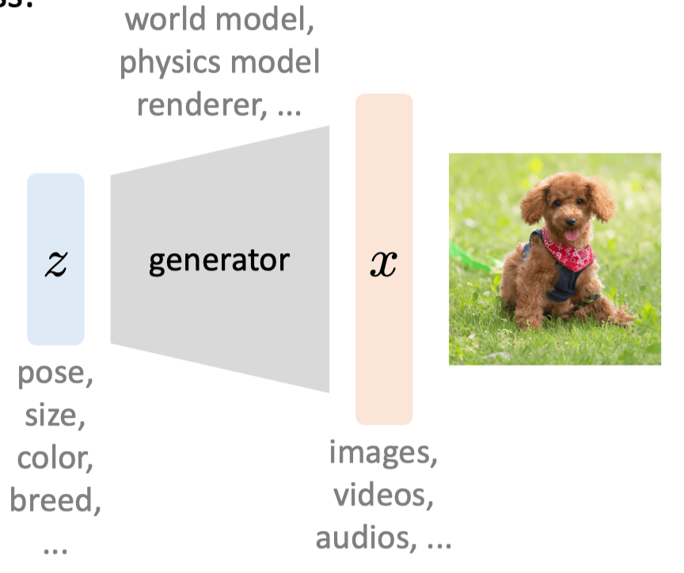

If the variables have distribution:

$$
z \sim p(z), x \sim p(x), \\
\text{generator:  } p(x \mid z)
$$

We can represent a distribution by a neural network, $p_{\theta}(x \mid z)$, $\theta$ is learnable parameters.

Measure how good a distribution is, we minimize Kullback–Leibler (KL) divergence（KL散度）
$$
\min _\theta \mathcal{D}_{\mathrm{KL}}\left(p_{\text {data }} \| p_\theta\right)
$$

This item is same as maximize likelihood（最大似然估计）:
$$
\max _\theta \mathbb{E}_{x \sim p_{\text {data }}} \log p_\theta(x)
$$

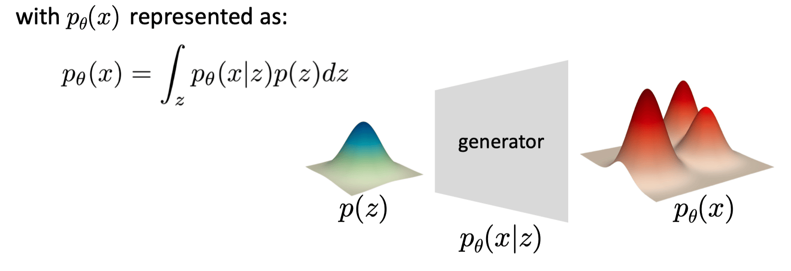

> kimi对这个函数的解释：
> 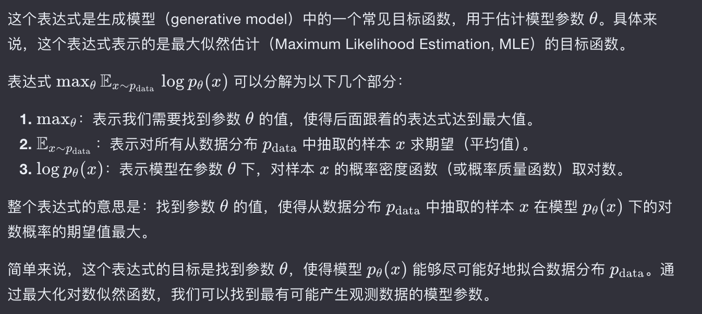

在这个目标函数中，我们有两项是未知的，一个是需要优化的参数$\theta$，另一项是我们无法控制$p(z)$
因此，我们需要引入一个可控的分布$q(z)$，将该分布用隐变量$z$重写为：

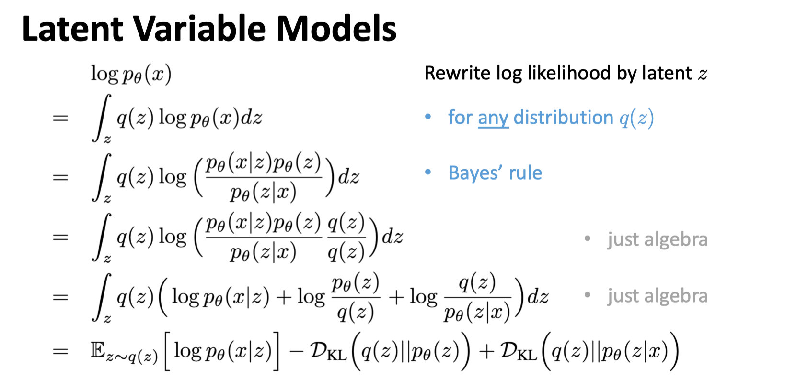
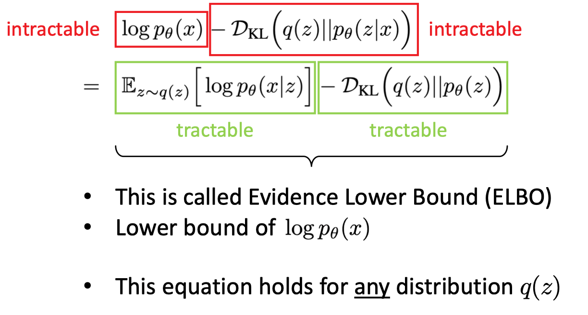

为了近似计算这个结果，我们引入了证据下界（Evidence Lower Bound, ELBO）

> kimi对这个函数的解释：
> 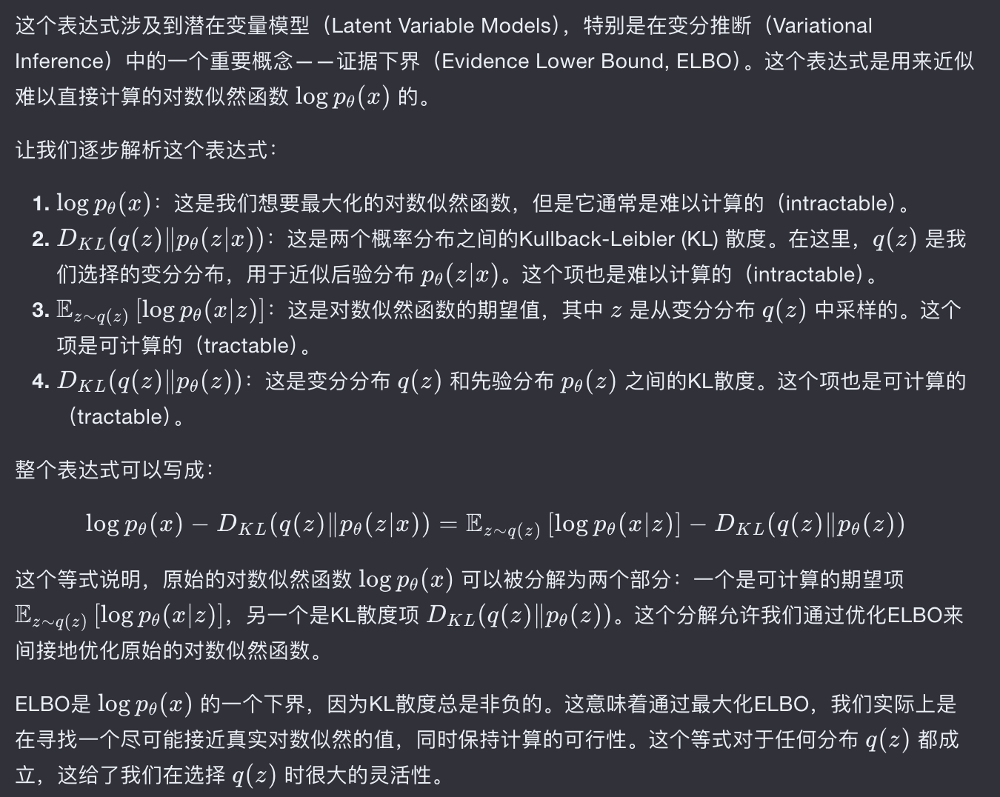

通过参数化，我们可以将优化目标写成：

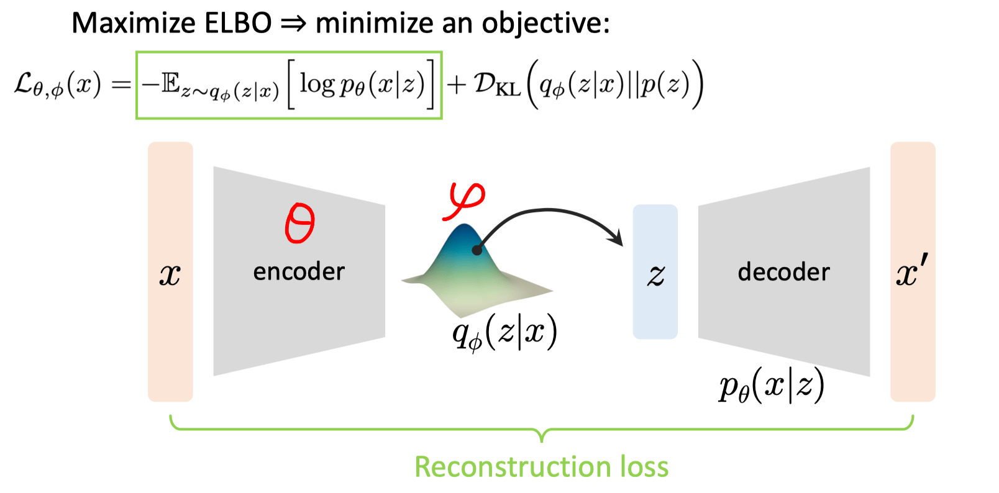

- 第一项是重建loss，比如L2 loss -> a Gaussian neighborhood around data point x
- 第二项是正则约束，让该分布向标准正态分布靠拢

Inference的过程：

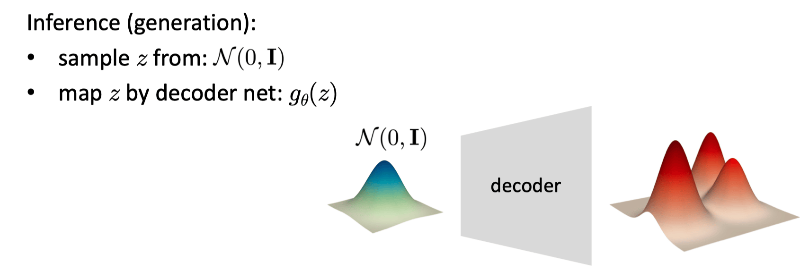

VAE是对AE(Auto Encoder)的改进，Encoder输出的是一系列的正态分布的均值和方差，
然后在这一系列的正态分布中采样得到隐变量，采样后的隐变量再输入到Decoder中。
这样做的好处就是隐变量是随机的正态分布，在测试时就可以从这些正态分布中直接采样出隐变量，输入给Decoder。
Decoder就是一个生成器，从一个分布到另一个分布的映射是确定的，**from latent distribution to data distribution**
而且在VAE中，Encoder编码出的隐向量是连续的。

## Relation to Expectation-Maximization (EM)

Two sets of variables:
- $q$: distribution of latent variables
- $\theta$: parameters of generator

VAE:
- parametrize $q$ by a network
- optimize by SGD

Expectation-Maximization(EM):
- often parametrize $q$ **analytically**
- optimize by **coordinate descent**(i.e., alternating optimization 交替优化)

EM as A Max-Max Procedure: 
EM算法通过交替执行两个步骤来优化参数：E步（期望步）和M步（最大化步），
在E步中，我们固定模型参数$\theta$ 并计算$q$的参数，使得期望的对数似然最大化，
在M步中，我们固定$q$的参数并更新模型参数$\theta，以最大化期望的对数似然，
这两个步骤交替进行，直到模型收敛

## Vector Quantized VAE (VQ-VAE)

当隐向量的离散分布的时候，就会有一个问题，如何对离散采样进行反向传播

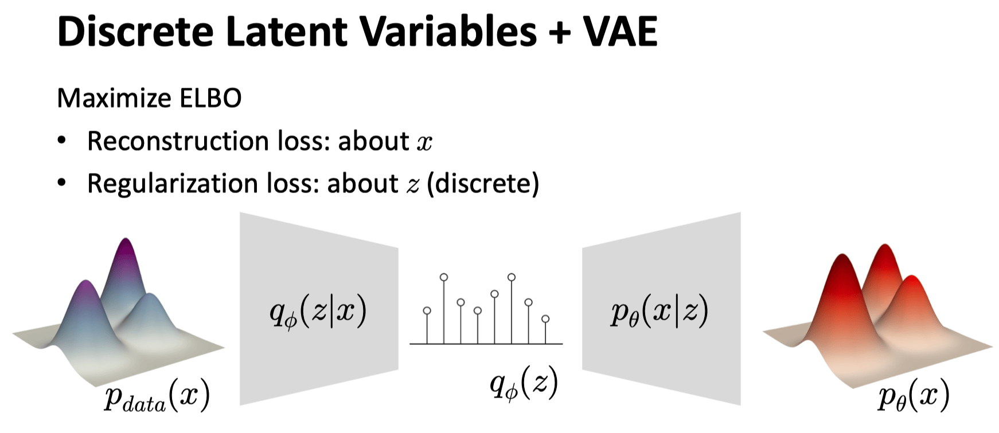

一种solution是用K-means
- K-means is autoencoding
- K-means has an objective function(reconstruction loss)
- K-means implicitly encourages codebook uniformity（尽可能均匀分布）

引入VQ-VAE，VQ-VAE实际上只是一种类似于AE的编码解码器，并没有生成功能，
它需要联合如PixelCNN等模型才能进行生成。
其中引入的codebook类似于一个字典，将连续的分布只离散化为一个embedding space

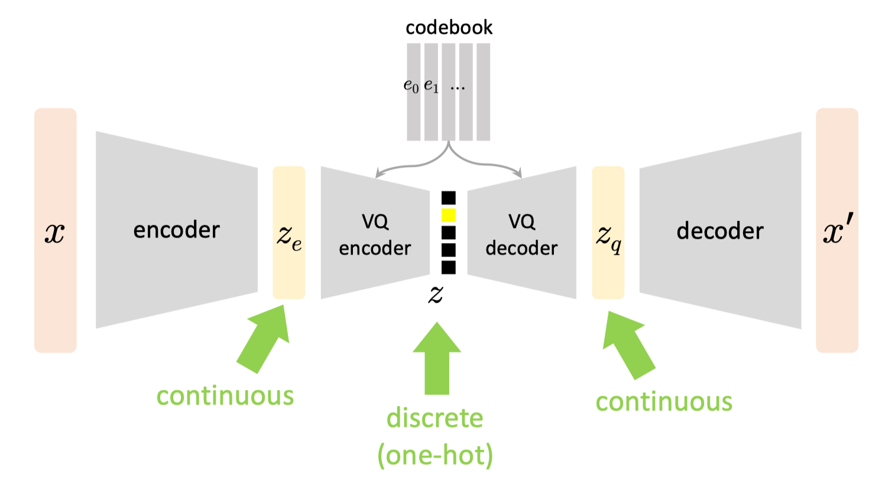

但是VQ-VAE涉及了一个字典查询相似的采样操作，和VAE一样会出现梯度中断的问题，
所以需要设计一种梯度反传的策略。

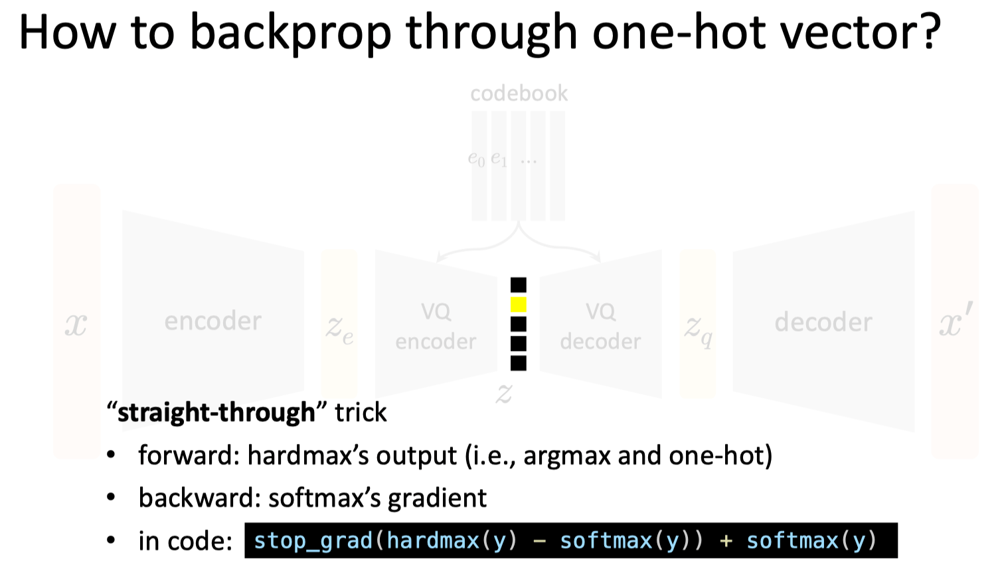

A single one-hot latent is not useful
- it’s “deep K-means”: with deep encoder/decoder
- a valid generative model; but not a “good” one

VQ-VAE: often used as **“tokenizers”**
- output multiple one-hot vectors
- don’t reduce latent spatial/temporal size to 1
- use ConvNet/Transformer as encoder and decoder

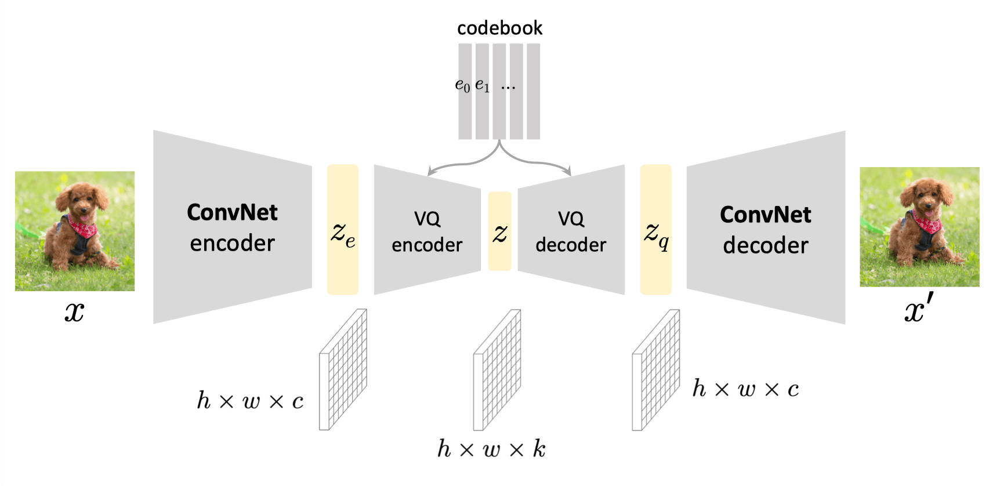

