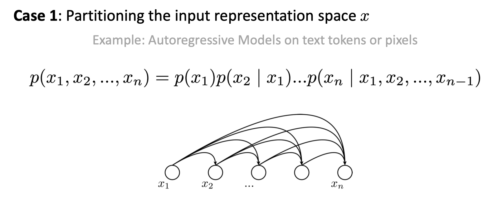
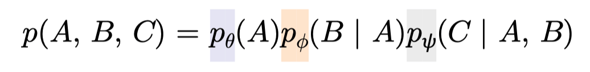
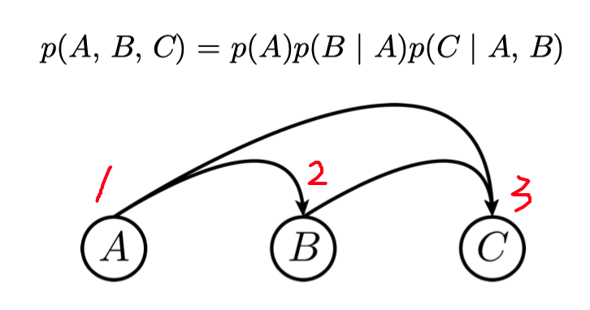
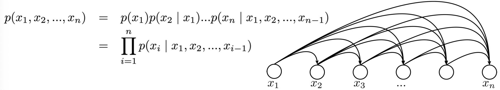
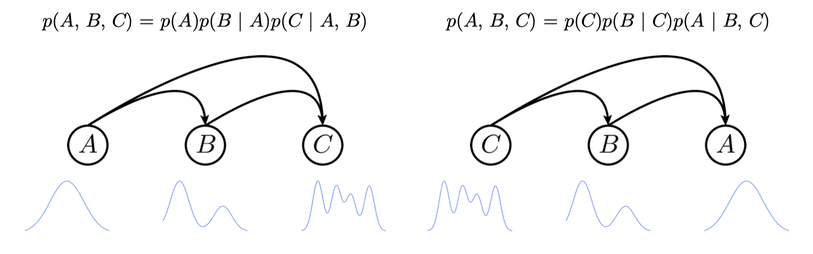
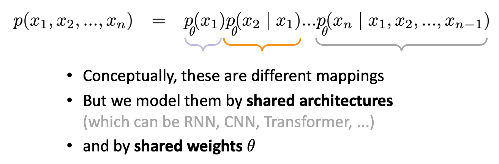
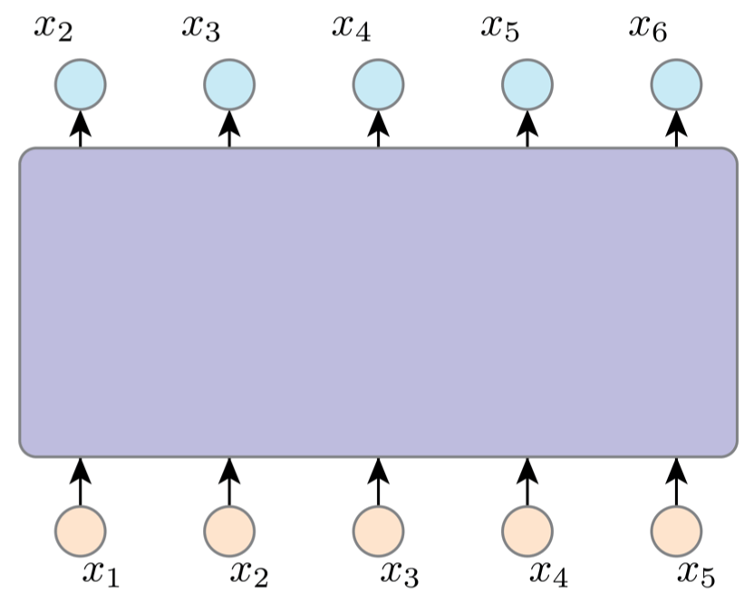

# Autoregressive Models

[slide link](https://mit-6s978.github.io/assets/pdfs/lec3_ar.pdf)

## ToC

<!--toc:start-->
- [Autoregressive Models](#autoregressive-models)
  - [ToC](#toc)
  - [Conditional Distribution Modeling](#conditional-distribution-modeling)
    - [Joint Distribution Modeling](#joint-distribution-modeling)
    - [Chain rule](#chain-rule)
    - [Dependency Graphs](#dependency-graphs)
  - [Autoregressive Model](#autoregressive-model)
    - [Inductive Bias](#inductive-bias)
    - [Training: Teacher-Forcing](#training-teacher-forcing)
  - [Network Architectures for AR models](#network-architectures-for-ar-models)
    - [Autoregression w/ Shared Computation](#autoregression-w-shared-computation)
<!--toc:end-->

## Conditional Distribution Modeling

### Joint Distribution Modeling

- Solution 1: Modeling by **indeppendent** latents (e.g. VAE) ❎
    - mapping independent to dependent
    - **strict** assumption for **high-dim** data :(
- Solution 2: Modeling by **conditional** distributions ✅

### Chain rule

Any joint distribution can be written as a **product of conditions**
- in any **order**（交换律）
- in any **partition**（结合律）

---

Modeling each conditional distribution with a neural network

- $p(A, B, C)$ has 3 variables
- $p(C \mid A, B)$ has 1 variable $C$ and 2 conditions $A, B$
- conditions are network inputs
- each network has its own weights, the weights are not sharing
- **weight sharing implies inductive biases**

### Dependency Graphs

- Decompose a joint distribution -> induce a dependency graph
- Dependency graphs reflect **prior knowledge**
- Some dependency graphs may induce simpler distributions ... （所以如何decompose很重要，学习一个简单的分布更加容易）

## Autoregressive Model

Auto + Regression
- Auto: "self"
    - using its "own" outputs as inputs for next perditions
- Regression:
    - estimating relationship between variables
- This implies an **inference-time** behavior（是针对inference而言的行为）
- Training-time is not necessarily autoregressive

---

In general, autoregression is a way of modeling **joint** distribution
by a product of **conditional** distributions:

- $x$ can be any representation
- $x$ can be any order and any partition
- each $p(\cdot \mid \cdot)$ can take any form(e.g., look-up tables, tree, networks)
- This formulation makes no compromise/approximation

### Inductive Bias

We want the decomposition to give us simpler distributions and want the decomposed distributions to be represented by **similar** neural networks.

We want the decomposed distributions to be represented by "similar" neural networks.

我们在用neural networks表示分布的时候，就已经引入了归纳偏置（inductive biases）
- shared architectures, shared weights, ...
- with an induced decomposition, indeced order.

> [知乎的解读](https://zhuanlan.zhihu.com/p/531684586)：
> 归纳偏置可以理解为，从现实生活中观察到的现象中归纳出一定的规则（heuristics），然后对模型做一定的约束，从而起到“模型选择”的作用，即从假设空间中选择出更符合现实规则的模型。神经网络中各式各样的网络结构/组件/机制往往就来源于归纳偏置。
> inductive bias是关于求解目标函数的必要假设。
> CNN的inductive bias应该是locality和spatial invariance，即空间相近的grid elements有联系，比较远的则没有联系，以及空间不变性（kernel权重共享）
> RNN的inductive bias是sequentiality和time invariance，即序列顺序上的timesteps有联系，以及时间变换的不变性（rnn权重共享）

### Training: Teacher-Forcing

由于autogressive model的特性，如果根据inference graph来训练是不切实际的，计算量和复杂度非常高
于是引入了 teacher-forcing的机制：
- inputs are not from previous outputs, from **ground-truth** data

Pros:
- backprop path is much shorter
- ground-truth inputs can ease training

Cons:
- inconsistent training/inference mode
- distribution shift: can't see its own error

## Network Architectures for AR models

### Autoregression w/ Shared Computation

Autoregression is not architecture-specific, we can implement it with RNN/CNN/Transformers, ...

$$
\begin{gathered}
p\left(x_1, x_2, \ldots, x_n\right)= \\
\prod_{i=1}^n p\left(x_i \mid x_1, x_2, \ldots, x_{i-1}\right)
\end{gathered}
$$

In this example: we have 5 networks, each has 1 to 5 inputs

We can implement it by one shared network, with:
- shared architecture
- shared weights
- shared **computation**

if output $x_i$ not depend on the future output $x_j(j > i)$
