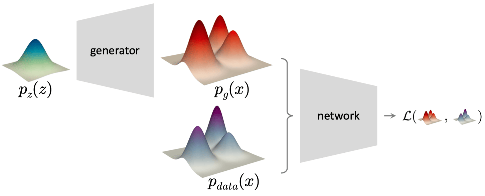
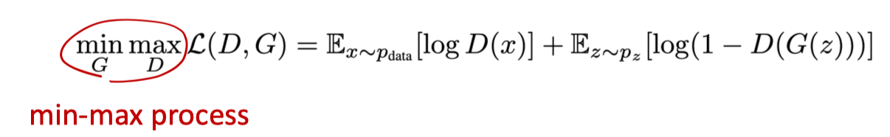
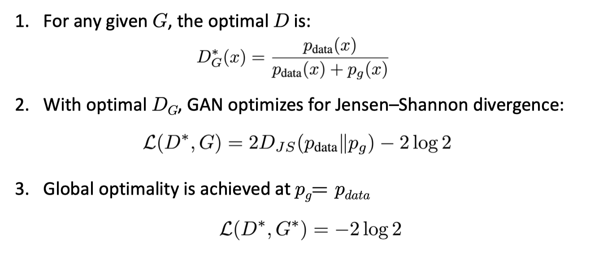
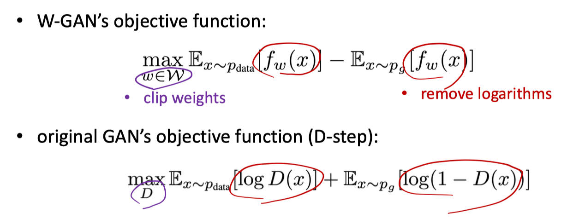
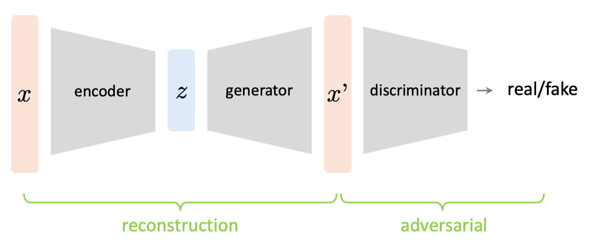

# Generative Adversarial Networks

[slide link](https://mit-6s978.github.io/assets/pdfs/lec4_gan.pdf)

## ToC

<!--toc:start-->
- [Generative Adversarial Networks](#generative-adversarial-networks)
  - [ToC](#toc)
  - [GAN](#gan)
    - [Adversarial Objective](#adversarial-objective)
  - [Wasserstein GAN (W-GAN)](#wasserstein-gan-w-gan)
  - [Adversary as a Loss Function](#adversary-as-a-loss-function)
<!--toc:end-->

## GAN

- Representing **distribution difference** by a neural network. 
- Generative models w/ discriminative models.
- Min-max process

### Adversarial Objective

- $G$ is the generator
- $D$ is the discriminator
- **D step**: fix G, optimize D
    - D to classify real or fake
    - binary logistic regression (sigmoid + cross-entropy)
- **G step**: fix D, optimize G
    - generate fake data such that D classifies it as "real"
    - make G to "confuse" D

理论的优化结果：

> $D_{JS}$ 表示 Jensen–Shannon divergence（JS散度），GAN的优化目标

GAN的问题: difficult to train/converge
- Hard to achieve equilibrium（很难平衡，会振荡）
- Vanishing gradients（梯度消失）
- Mode collapse（模式坍塌）

## Wasserstein GAN (W-GAN)

JS散度的问题
- 当 $p$ 和 $q$ 没有overlap的时候，是一个常数，因此没有梯度无法优化

引入Wasserstein Distance作为优化目标（数学推理太复杂了）
- gradient is bounded
- weights are bounded
- linear gradients in W-GAN
- remove logarithms
- clip weights (Lipschitz continuity)

## Adversary as a Loss Function

除了reconstruction loss之外，GAN自带一个adversarial loss，$L(x, x\prime)$
- Beyond L2/L1: adversarial loss encourages output to look “realistic”
- Combined with L2/L1: reconstruction loss largely **stabilizes training**

GAN = VAE + Adv Loss + Perceptual Loss
